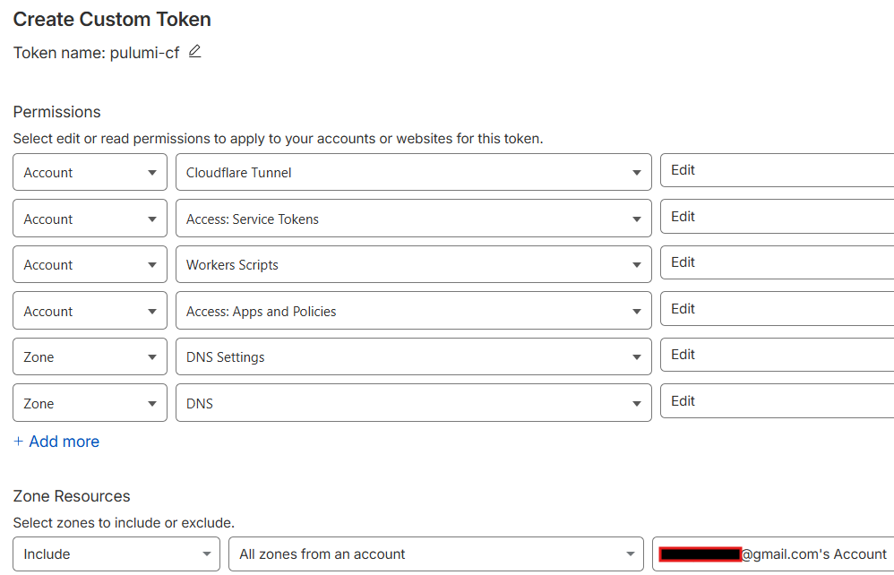

# AWS-EC2-Redirector 

본 플루미 Role은 Cloudflare Tunnel과 Workers를 이용해 C2 서버의 특정 포트를 인터넷에 노출시킵니다. 

대상 PC -> Workers (HTTP Header/UA check) -> (Cloudflare Service Token Check) -> Cloudflare Tunnel -> C2 서버 

IaC 프로젝트이기 때문에 실행 전 `.env` 파일을 꼭 업데이트 해야합니다. 

## 필수 요소 

1. Cloudflare 계정 
2. Cloudflare에 등록되어 있는 공격자 도메인
3. Cloudflare API Token 



## 사용법 

0. 의존성 설치 
```
python3 -m venv venv
source venv/bin/activate
pip3 install -r requirements.txt
```

- DNS ZoneID, Account ID: Cloudflare > Domains에서 도메인 선택 > 오른쪽 아래 Zone ID, Account ID 

1. `.env.example` 파일 업데이트 이후 `.env` 로 파일 이름 변경 
```
# 파일 수정... 
vim .env.example 

# 파일 이름 변경 
mv .env.example .env 
```

2. 실행 
```
pulumi stack init dev   # 첫 실행 시 한번만 실행
pulumi preview          # syntax, sanity-check 용 
pulumi up -y            # 실행! 
```

(3. 삭제/Revert)
```
pulumi destroy -y 
```

## 배포 후 필수 설정 

0. pulumi stack output 을 통해 필요한 정보 획득 

1. 클라우드플레어 > Compute & AI > Workers & Pages > c2-proxy-worker > Settings > Domain & Routes -> Enable Domain (workers.dev) 

2. wget https://github.com/cloudflare/cloudflared/releases/latest/download/cloudflared-linux-amd64

3. cloudflared tunnel run --token <토큰>

## 테스트 

Cloudflare Workers를 향해 정해진 HTTP Header/UA를 갖고 트래픽을 보냅니다. 

C2 서버에는 updog를 이용해 웹 서버를 하나 돌린 뒤, 대상 PC에서 Workers와 Tunnel을 통해 파일을 접근할 수 있는지 확인합니다 

성공 
```
└─$ curl -H "X-Custom-Header-1: SecretValue1" -H "X-Custom-Header-2: SecretValue2" -H "User-Agent: Mozilla/5.0 CustomAgent" https://c2-proxy-worker.fonts-cdn.workers.dev
Hello from C2 server! 
```

실패 
```
└─$ curl https://c2-proxy-worker.fonts-cdn.workers.dev/hi.txt                                            
Forbidden
```